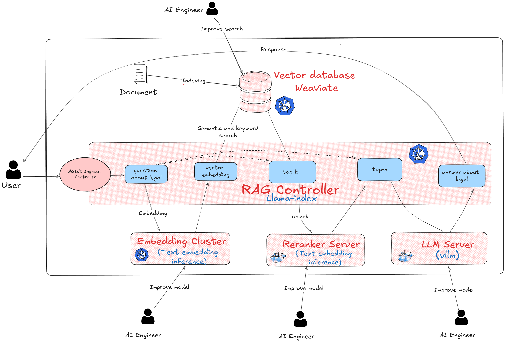
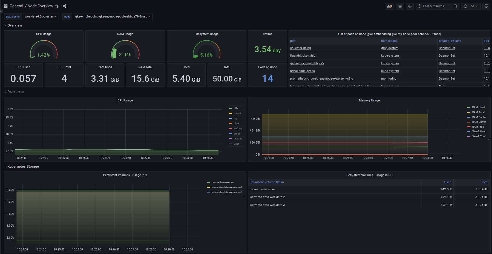
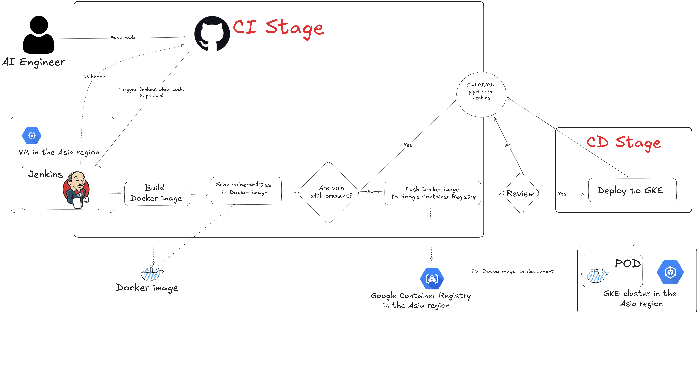
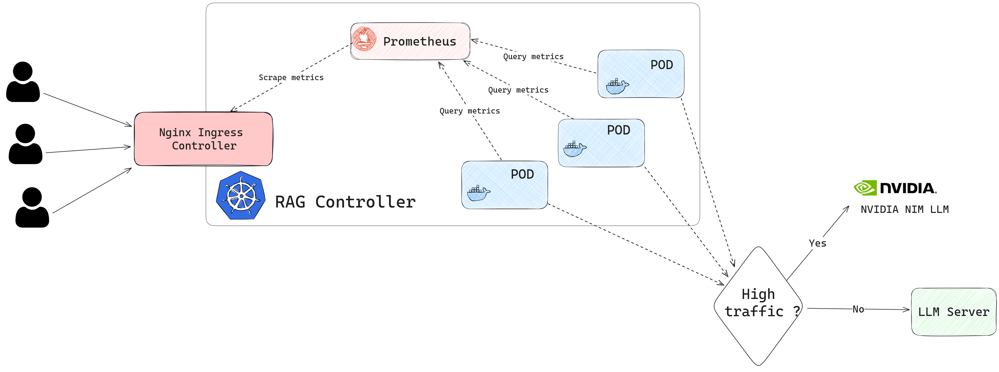

## High level architecture



## Project structure
------------
    ├── embedding/
    │ ├── helm-charts/                      <- Chart for deployment of Embedding model
    │ ├── terraform/                        <- Create GKE Embedding cluster (Using Cluster Autoscaling)
    │ └── gce/
    │ ├── secret/                           <- Google Cloud credentials
    │ └── setup/                            <- Setup GCE, deploy Grafana and Jenkins on this GCE
    ├── monitoring/
    │ ├── grafana_config/                   <- Grafana configuration, includes datasource and dashboard
    │ ├── helm-charts/                      <- Chart for deployment of Prometheus Agent on each GKE Cluster
    │ └── docker-compose.yml                <- Docker Compose for running Monitoring on GCE
    ├── rag-controller/
    │ ├── helm-charts/                      <- Chart for deployment of RAG Controller
    │ ├── src/                              <- Core RAG, customized from https://github.com/zylon-ai/private-gp
    │ ├── terraform/                        <- Create GKE RAG Controller cluster (Using Cluster Autoscaling)
    │ ├── .env_local                        <- Environment configuration for local setup
    │ ├── docker-compose.yml                <- Docker Compose for local deployment
    │ ├── Dockerfile                        <- Dockerfile for RAG Controller
    │ ├── main.py                           <- FastAPI app creation for RAG Controller
    │ ├── poetry.lock
    │ ├── pyproject.toml
    │ ├── README.md
    │ ├── settings-prod.yaml                <- System settings for deployment
    │ ├── settings.yaml                     <- Settings template
    │ └── start_local.sh                    <- Script for local deployment
    ├── reranker-llm/
    │ ├── .env
    │ └── docker-compose.yml                <- Docker Compose for LLM and Reranker component deployment on GPU Server
    └── weaviate/
    ├── helm-charts/                        <- Helm charts for Weaviate deployment
    └── terraform/                          <- Create GKE Weaviate cluster (Using Cluster Autoscaling)
    ├── Jenkinsfile
    └── README.md
------------
### Versions of packages used for configuration and deployment

+ [kubectl](https://kubernetes.io/vi/docs/tasks/tools/) v1.28.2
+ [kubens, kubectx](https://github.com/ahmetb/kubectx) v0.9.5
+ [helm](https://helm.sh/) v3.15.3
+ [terraform](https://www.terraform.io/) v1.8.2
+ [docker-compose](https://docs.docker.com/compose) v2.21.0
+ [ansible](https://docs.ansible.com/ansible/latest/collections/google/cloud/gcp_compute_instance_module.html) v2.13.13

## Embedding Component

+ Create GKE Cluster
```bash
cd embedding/terraform
terraform init
terraform apply 
```

+ Deployment

    + Create the namespace `emb`
    ```bash
    kubectl create ns emb
    kubens emb
    ```
    
    + Deploy (For details on deployment values, see `embedding/helm-charts/emb/values.yaml`)
    ```bash
    helm upgrade --install emb embedding/helm-charts/emb --namespace emb
    ```

    The Embedding GKE cluster uses a Docker image with a backend text-embeddings-inference that pulls the model from Huggingface based on the model-id. To change the model, update the value at `deployment.container.args`.


## Weaviate Component

+ Create GKE Cluster
```bash
cd weaviate/terraform
terraform init
terraform apply 
```
+ Deployment

    + Create the namespace  `weaviate`
    ```bash
    kubectl create ns weaviate
    ```
    
    + Deploy (For details on deployment values, see `weaviate/helm-charts/weaviate/values.yaml`)
    ```bash
    helm upgrade --install weaviate weaviate/helm-charts/weaviate --namespace weaviate
    ```

## Reranker and LLM Component (Runs on GPU server)

+ Replace the Reranker and LLM models in the docker-compose.yml file

+ Deploy
```bash
cd reranker-llm
docker compose up --build
```

## RAG Controller Component 

+ Some important files
    + `rag-controller/src/server/chat/chat_service.py`
    + `rag-controller/src/settings/settings.py`
    + Files in `rag-controller/src/components`
+ Create GKE Cluster
```bash
cd rag-controller/terraform
terraform init
terraform apply
```

+ Deploy

    + Deploy nginx ingress
    ```bash
	kubectl create namespace ingress-nginx
	kubens ingress-nginx
	helm upgrade --install ingress-nginx rag-controller/helm-charts/ingress-nginx \
	--namespace ingress-nginx \
	--set controller.metrics.enabled=true \
	--set-string controller.podAnnotations."prometheus\.io/scrape"="true" \
	--set-string controller.podAnnotations."prometheus\.io/port"="10254" \
    ```
    
    + Create the namespace `rag`
    ```bash
    kubectl create ns rag
    ```
    
    + Deploy the RAG controller (For details on deployment values, see `rag-controller/helm-charts/rag/values.yaml`)

        Create a secret for the `NVIDIA_NIM_API` environment variable if using [NVIDIA_NIM](https://build.nvidia.com/explore/discover) 

        ```bash
        kubectl create secret generic rag-secret --from-literal=NVIDIA_NIM_API=[YOUR_API_KEY]
        ```

        ```bash
        helm upgrade --install rag rag-controller/helm-charts/rag --set deployment.image.name=duong05102002/rag-controller \
        --set deployment.image.version=v0.0.21 --namespace rag
        ```

    +  UI

            
## Monitoring (Using remote-write pattern)


+ On Each GKE Cluster

    + Update `server.remoteWrite` and add label to `serverFiles.prometheus.yml.scrape_configs` to distince cluster name in the `monitoring/helm-charts/prometheus/values.yaml` file.

        ```bash
        kubectl create ns monitoring
        kubens monitoring
        helm dependency build monitoring/helm-charts/prometheus --namespace monitoring
        helm upgrade --install prometheus monitoring/helm-charts/prometheus --namespace monitoring
        ```

+ On the Monitoring Server

    ```bash
    cd monitoring
    docker-compose up --build
    ```

+ Some dasboards:

    + Weaviate Dashboard
        
## CI/CD



## Automatically redirect requests to third-party LLM API

Check `auto_redirect` in `rag-controller/settings-prod.yaml` to configure PromSQL and the threshold for redirecting requests to the NVIDIA NIM API.
